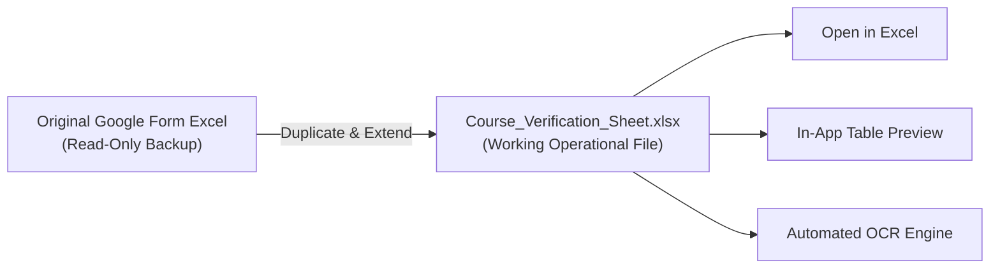

# Branch 2 (Session 4) — Sheet Health, Immutable Worksheets & Desktop Data-Binding Pitfalls

> **Target Audience:** Web Developer learning Desktop Engineering (PowerShell + WPF)  
> **Topic:** Decoupling Input Auditing from Business Logic, WPF Trailing Whitespace Traps, Forced Cache Busting, and Safe Object Mutation  
> **Date:** September 2026  

---

## 1) Decoupling Input Validation from the Business Pipeline

### 1.1 The Web Dev Analogy
In web development, when a user uploads a form or CSV to an endpoint:
1. **Schema & Header Validation (Middleware/Formik/Zod):** Checks if required fields (`name`, `email`, `fileUrl`) are present in the payload. It does **not** process payment or verify identity.
2. **Business Engine (Service/Queue):** Takes the valid payload, runs background workers, verifies bank records, or issues tickets.

If you combine step 1 and step 2 into a single screen, users get confused thinking: *"Is the app already verifying records? Why is it saying 'Pending Review' when I just selected a file?"*

### 1.2 Desktop Architecture: "Registration Sheet Health" vs. Verification
Earlier in Session 4, our panel was called *"Sheet Intelligence & Column Audit"* with warnings like *"All students will default to pending verification until reviewed"*. This mistakenly framed sheet inspection as a verification stage.

We refactored this into a strictly observational panel: **`Registration Sheet Health`**:
- **Its only job:** Reads the raw spreadsheet columns and reports:
  - Are standard columns (`RollNo`, `Name`, `Email`, `ProofUrl`, etc.) present?
  - What are the basic counts (*Total Students*, *Exam Registered*, *Other / Not Registered*)?
- **Zero verification jargon:** No medical or triage terms, no "Pending Review" statuses, and no fake verification stages.

```text
❌ WRONG:  Combining file inspection with the verification queue:
           "Sheet Column Audit — All students marked unverified in review queue"

✅ RIGHT:  Strictly reporting sheet health before any verification runs:
           "Registration Sheet Health — 7/7 Standard Columns Detected"
```

---

## 2) The WPF DataGrid Trailing Whitespace Reflection Trap

### 2.1 The Bug
In our in-app preview table (`DataGridSheetPreview`), the column `"Upload proof of registration"` showed completely **empty cells**, even though the underlying spreadsheet had valid Google Drive links in every single row!

### 2.2 Why it Happened
When Google Forms exports a spreadsheet, column headers often have subtle trailing spaces created by human input:
`"Upload proof of registration "` *(notice the space at the end)*.

When a WPF `DataGrid` with `AutoGenerateColumns="True"` binds to an array of objects:
1. WPF generates a column binding: `new Binding("Upload proof of registration ")`.
2. WPF's internal `PropertyPath` tokenizer **automatically trims whitespace**:  
   `BindingPath = "Upload proof of registration"` *(without the space)*.
3. WPF reflection attempts to find property `"Upload proof of registration"` on the `PSCustomObject`.
4. Because the object only has `"Upload proof of registration "`, the property lookup fails silently, returns `$null`, and renders an **empty cell**!

```text
Raw Excel Header:      "Upload proof of registration " (Length: 30)
WPF Binding Path:      "Upload proof of registration"  (Length: 29, Trimmed by WPF)
Reflection Lookup:     FAIL -> Silent $null -> Empty Cell
```

### 2.3 The Web Dev Equivalent & The Fix
In JavaScript, `obj["Upload proof of registration "]` works, but if a frontend library normalizes keys by trimming them, `obj[key.trim()]` returns `undefined`.

**The Desktop Solution:** Always normalize all column keys and header names by trimming them immediately upon spreadsheet ingestion in `modules/Import-StudentSheet.ps1`:

```powershell
# Clean every property name before building the row object
$cleanRowDict = [ordered]@{}
foreach ($prop in $row.PSObject.Properties) {
    $cleanPropName = $prop.Name.Trim()
    $cleanRowDict[$cleanPropName] = $prop.Value
}
$validRows += [PSCustomObject]$cleanRowDict
```

Now, WPF DataGrid auto-generation, manual bindings, and model mapping all match with 100% precision.

---

## 3) The Immutable Source Pattern & The "Verification Sheet"

### 3.1 The Problem
When the coordinator is ready to verify students, where should the `Verification Status` (`Verified` / `Rejected`) be recorded?
- If you write back into the coordinator's original Google Forms response Excel file, you risk corrupting the user's primary backup or hitting exclusive file-locking errors (`EBUSY`).
- If you only store it in JSON, non-technical college administrators who demand an Excel file have nothing to open.

### 3.2 The Solution: Dedicated Working Copy
We introduced the **Verification Sheet** pattern:
1. **Source of Truth (Immutable):** The original `Registration Sheet` is treated as strictly read-only.
2. **Working Copy (Mutable):** Clicking `[ + Generate Verification Sheet ]` creates a dedicated working copy:  
   `[Course_Name]_Verification_Sheet.xlsx` (saved alongside the original).
3. **Appended Operational Fields:** The generated copy preserves all original student data and appends two standard columns:
   - `Verification Status` (initialized to `'Pending'`)
   - `Verification Remarks` (initialized to `'Awaiting Verification'`)



---

## 4) Safe Object Mutation in PowerShell 5.1 (`[PSCustomObject]`)

### 4.1 The Trap: Dynamic Member Assignment
In JavaScript / TypeScript, you can dynamically assign new properties to an object at any time:
```javascript
course.verificationSheet = "path/to/file.xlsx"; // Works flawlessly in JS
```

In **PowerShell 5.1**, when an object is deserialized from JSON via `ConvertFrom-Json`, it becomes a strongly-typed `[PSCustomObject]`. If the property does not already exist in the underlying member collection, assigning it throws a runtime crash:

```text
Exception setting "VerificationSheet": The property 'VerificationSheet' cannot be found on this object.
Verify that the property exists and can be set.
```

### 4.2 The Fix: Explicit Member Addition
To safely add or update properties on deserialized PowerShell objects:

```powershell
# Safe Property Assignment Pattern for PowerShell 5.1 / 7
if ($Course.PSObject.Properties['VerificationSheet']) {
    $Course.VerificationSheet = $targetPath
} else {
    $Course | Add-Member -NotePropertyName 'VerificationSheet' -NotePropertyValue $targetPath -Force
}
```

We also added schema migration in `Load-Courses` so that all loaded courses automatically have `VerificationSheet = ""` initialized upon startup.

---

## 5) Manual Cache Busting with `-Force`

### 5.1 Stale Cache vs. User Edits
In Session 3, we built local JSON caching (`data/students_<courseId>.json`) to prevent 1500ms XML Excel re-parsing lag on every view switch.

However, if a coordinator opens Excel outside the app, fixes a student's roll number typo, and saves the file, our app would still load the stale JSON cache.

### 5.2 The `[Recheck Health]` Pattern
We added a `-Force` switch to `Get-CourseStudentStore`:
- **Default Navigation:** Reads local JSON in `2ms`.
- **Coordinator Clicks `[Recheck Health]`:** Passes `-Force`, bypasses the JSON cache, re-parses the disk file, overwrites the JSON store with fresh data and a new `LastSync` timestamp, and re-renders the UI instantly.

```powershell
function Get-CourseStudentStore {
    param(
        [string]$CourseId,
        [string]$RegistrationSheet = $null,
        [switch]$Force
    )
    # Fast path: Load from JSON cache only if -Force is NOT specified
    if (-not $Force -and (Test-Path -LiteralPath $filePath)) {
        return (Get-Content $filePath -Raw | ConvertFrom-Json)
    }

    # Force path: Re-ingest from raw spreadsheet on disk
    $sheetResult = Import-StudentSheet -Path $RegistrationSheet
    Save-CourseStudents -CourseId $CourseId -Students $sheetResult.Students
    return $freshStore
}
```

---

## 6) Summary of Decisions & Milestones in Session 4

1. **Refactored Registration Sheet Health:** Removed all fake verification language and presented clean metrics (Total Students, Exam Registered, Other).
2. **Fixed WPF DataGrid Trailing Space Bug:** Normalized and trimmed all column keys so links and cells bind reliably.
3. **Built Verification Sheet Pipeline:** Added the `Verification Sheet` dashboard panel, `New-CourseVerificationSheet` generator, and safe `Add-Member` mutation.
4. **Added `[Recheck Health]` Button:** Integrated forced cache bypass for live updates when spreadsheets change on disk.
